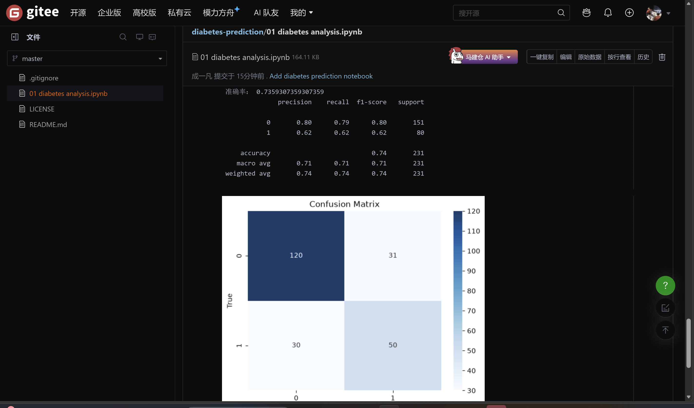
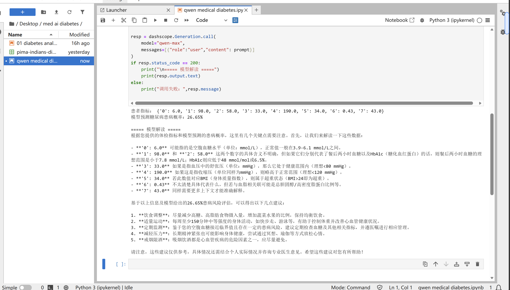

# 糖尿病风险预测分析
## 项目简介
基于Pima Indians Diabetes数据集，使用机器学习方法构建糖尿病风险预测模型，对比逻辑回归与随机森林两种算法的表现，并结合大模型进行临床结果解读。近期新增临床决策优化模块：通过阈值调整降低漏诊率，利用ROC与概率校准提升模型在医学筛查中的安全性；进而，利用Qwen-Max实现JSON结构化输出与多轮对话，将模型预测结果无缝对接至自动化系统。
## 📂 仓库文件说明

### 数据探索与基础建模
- `01 diabetes analysis.ipynb`：数据探索与可视化分析
- `diabetes_risk_prediction_day2.ipynb`：逻辑回归基线模型与初步Qwen大模型解读
- `diabetes_risk_prediction_day3.ipynb`：随机森林模型与双模型对比

### 方向一：临床决策优化
- `04_clinical_optimization.ipynb`：阈值调整、ROC曲线与概率校准

### 方向三：大模型进阶（JSON与多轮对话）
- `05_llm_agent.ipynb`：JSON结构化输出与多轮对话问诊

### 方向二：交互式产品原型
- `06_save_model.ipynb`：模型持久化（保存 `diabetes_model.pkl` 和 `scaler.pkl`）
- `07_interactive_tool.ipynb`：终端交互工具（手动输入指标、实时输出报告）
- `08_functions.ipynb`：函数封装（`predict_patient` 与 `print_report`）
- `09_gradio_app.ipynb`：Gradio 网页版预测工具（支持滑块输入与实时报告生成）

### 数据与文档
- `pima-indians-diabetes.csv`：原始数据集
- `README.md`：项目说明文档

## 📊 数据集介绍

本项目使用 **Pima Indians Diabetes Dataset**（皮马印第安人糖尿病数据集），这是机器学习领域经典的医学分类数据集。

- **样本数量**：768条
- **特征数量**：8个生理指标
- **目标变量**：是否患有糖尿病（0=否，1=是）
- **数据来源**：美国国立糖尿病、消化和肾脏疾病研究所

**特征说明：**

| 特征名 | 含义 |
|---|---|
| Pregnancies | 怀孕次数 |
| Glucose | 口服葡萄糖耐量试验中的血糖浓度 |
| BloodPressure | 舒张压（mm Hg） |
| SkinThickness | 三头肌皮褶厚度（mm） |
| Insulin | 2小时血清胰岛素（mu U/ml） |
| BMI | 体重指数 |
| DiabetesPedigreeFunction | 糖尿病遗传函数 |
| Age | 年龄（岁） |

## 🔬 项目流程

### 1. 数据读取与基础探查
- 使用pandas读取CSV数据
- 查看数据基本信息（行数、列数、数据类型）
- 检查缺失值和异常值

### 2. 描述性统计
- 计算各特征的均值、标准差、最小值、最大值、四分位数
- 分析目标变量分布（正负样本比例）

### 3. 探索性数据分析（EDA）
- 绘制各特征的分布直方图
- 绘制特征间相关性热力图
- 分析各特征与目标变量的关系

### 4. 逻辑回归基线模型
- 划分训练集和测试集（7:3）
- 数据标准化处理
- 训练逻辑回归模型
- 计算准确率、精确率、召回率、F1分数

### 5. 随机森林模型与双模型对比
- 训练随机森林分类器
- 与逻辑回归模型进行性能对比
- 分析特征重要性

### 6. Qwen-Max大模型临床解读
- 将模型预测结果输入Qwen-Max大模型
- 从临床角度解读预测结果
- 给出健康风险评估和生活方式建议
### 7. 临床决策优化
- 阈值调整：将默认 0.5 阈值下调，寻找医学筛查的最佳平衡点。当阈值降至 0.2 时，召回率从 62.5% 提升至 90%，漏诊人数从 30 人锐减至 8 人。
- ROC 曲线与 AUC：评估模型在所有阈值下的整体表现，模型 AUC = 0.798。
- 概率校准：使用 Platt Scaling 校准模型输出概率，Brier Score 从 0.1741 优化至 0.1718，让概率更接近真实发病率。
### 8. 大模型进阶（方向三）
- JSON结构化输出：让Qwen-Max输出机器可读的JSON数据（如 risk_level、main_factors），便于程序自动化处理（如屏幕报警、打印报告）。
- 多轮对话问诊：维护 messages 列表，实现患者“指标评估 → 报告生成 → 追问建议”的连续问诊流程。
- 异常捕获机制：使用 try...except 安全解析JSON，防止大模型输出格式不合规导致程序崩溃
### 9. 交互式产品原型（方向二）
- **模型持久化**：使用 `joblib` 保存训练好的模型和标准化器。
- **函数封装**：将推理逻辑封装为 `predict_patient()`，实现逻辑与展示分离。
- **Web 界面**：使用 Gradio 搭建网页版预测工具，支持滑块输入与实时报告生成，打通“数据→模型→大模型→前端展示”全链路。

## 📈 实验结果

### 模型性能对比

| 模型       | 准确率   | 精确率 | 召回率   | F1分数   |
|----------|---------|--------|----------|----------|
| 逻辑回归 | 73.59% | 62%    | 62%      | 62%      |
| 随机森林 | 75.32% | 63.86% | 66.25% | 65.03%|

**关键发现：**
随机森林模型的准确率略高于逻辑回归，血糖浓度（Glucose）是预测糖尿病最重要的特征
临床优化关键成果：
AUC：0.798（具备临床筛查价值）
最佳筛查阈值：0.2（召回率 90%，漏诊仅 8 人，精确率 49.66%）
概率校准：Brier Score 从 0.1741 降至 0.1718，中等风险区间的概率更准确。
结论：在糖尿病这种慢性病筛查中，宁可增加假阳性（多复查），也不能增加假阴性（漏诊）。通过阈值调整与概率校准，模型从“追求准确率”转向了“追求临床安全性”

### 结果可视化





## ✨ 项目亮点

1. **双模型对比**：同时使用逻辑回归和随机森林，横向对比不同算法的表现
2. **临床决策闭环**：引入阈值调整、ROC 曲线与概率校准，针对医学场景优化筛查安全性
3. **医学+AI结合**：基于真实医学数据集，关注临床可解释性
4. **大模型辅助解读**：引入Qwen-Max大模型，从临床医生视角解读预测结果
5. **完整流程**：从数据读取、EDA、建模、评估、临床优化到结果解读，覆盖机器学习全流程
6. **产品落地能力**：从纯数据建模延伸至交互式网页应用，具备完整的 AI 工具开发链路。

## 🛠️ 环境要求

- Python 3.8+
- 主要依赖库：pandas、numpy、scikit-learn、matplotlib、seaborn

## 🚀 如何运行

1. 克隆仓库到本地
```bash
git clone https://github.com/CR7KAFAN/diabetes-risk-ai.git
cd diabetes-risk-ai
2. 建议运行顺序：先运行 01 diabetes analysis.ipynb 完成数据探索，再依次运行 day2、day3 以及最新的 04_clinical_optimization.ipynb 查看临床优化结果。之后本人会持续完善此项目---2026.9.10。
## 免责声明
项目中大模型生成的建议仅供学习与参考，不构成医疗诊断依据，不能替代临床就诊。
